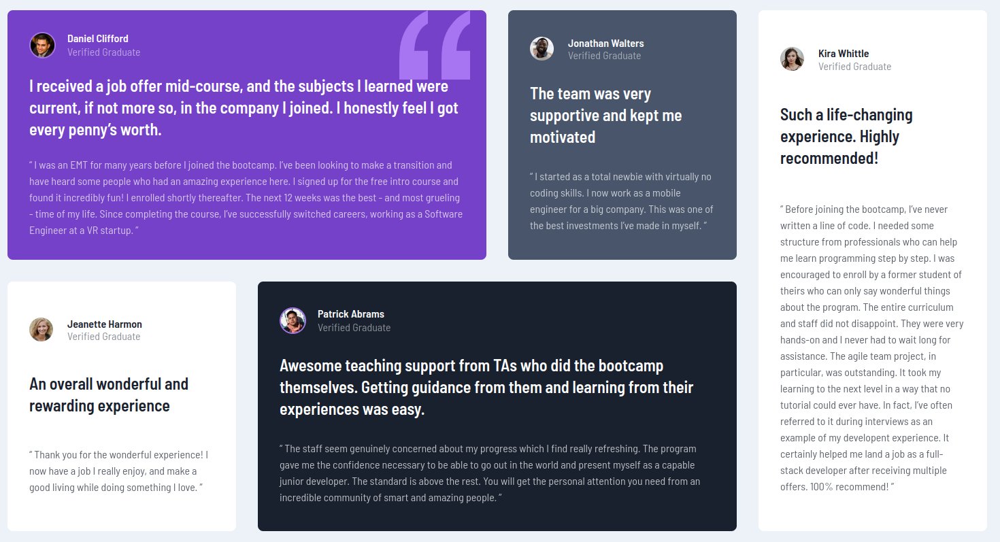
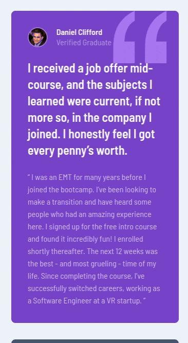
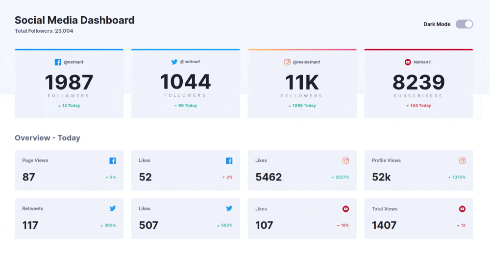
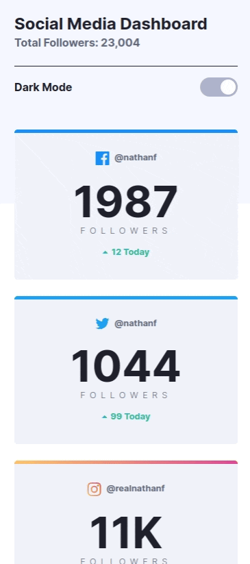

# Frontend Mentor Project
> This repository was created for my [Frontend Mentor](https://www.frontendmentor.io/challenges) challenges.

---

## Summary

- [Recipe page](#recipe-page)

## Challenges

### Recipe page

Challenge level = **Newbie** 
This is a solution for the [Recipe Page](https://www.frontendmentor.io/challenges/recipe-page-KiTsR8QQKm) challenge.

#### Screenshots

Challenge completed: [my solution](https://anac-ac.github.io/frontend-mentor/level-newbie/recipe-page/index.html)

    
&nbsp; &nbsp; &nbsp; &nbsp;
       

#### Skills praticadas

- Semantics in HTML5
- Flexbox display
- Responsiveness

---

### Testimonials Grid Section

Challenge level = **Junior** 
This is a solution for the [Testimonials Grid Section](https://www.frontendmentor.io/challenges/testimonials-grid-section-Nnw6J7Un7) challenge.

#### Screenshots

Challenge completed: [my solution](https://anac-ac.github.io/frontend-mentor/level-junior/testimonials-grid-section/index.html)

    
&nbsp; &nbsp; &nbsp; &nbsp;
       

#### Skills praticadas

- Grid display
- Responsiveness
- Semantics in HTML5
  
---
### Social Media Dashboard With Theme Switcher

Challenge level = **Junior** 
This is a solution for the [Social Media Dashboard With Theme Switcher](https://www.frontendmentor.io/challenges/social-media-dashboard-with-theme-switcher-6oY8ozp_H) challenge.

#### Screenshots

Challenge completed: [my solution](https://anac-ac.github.io/frontend-mentor/level-junior/social-media-dashboard-with-theme-switcher-master/index.html)

    
&nbsp; &nbsp; &nbsp; &nbsp;
       
      
       
&nbsp; &nbsp; &nbsp; &nbsp;
    

#### Skills praticadas

- Flex display
- Responsiveness using flex properties
- Semantics in HTML5
  
---
