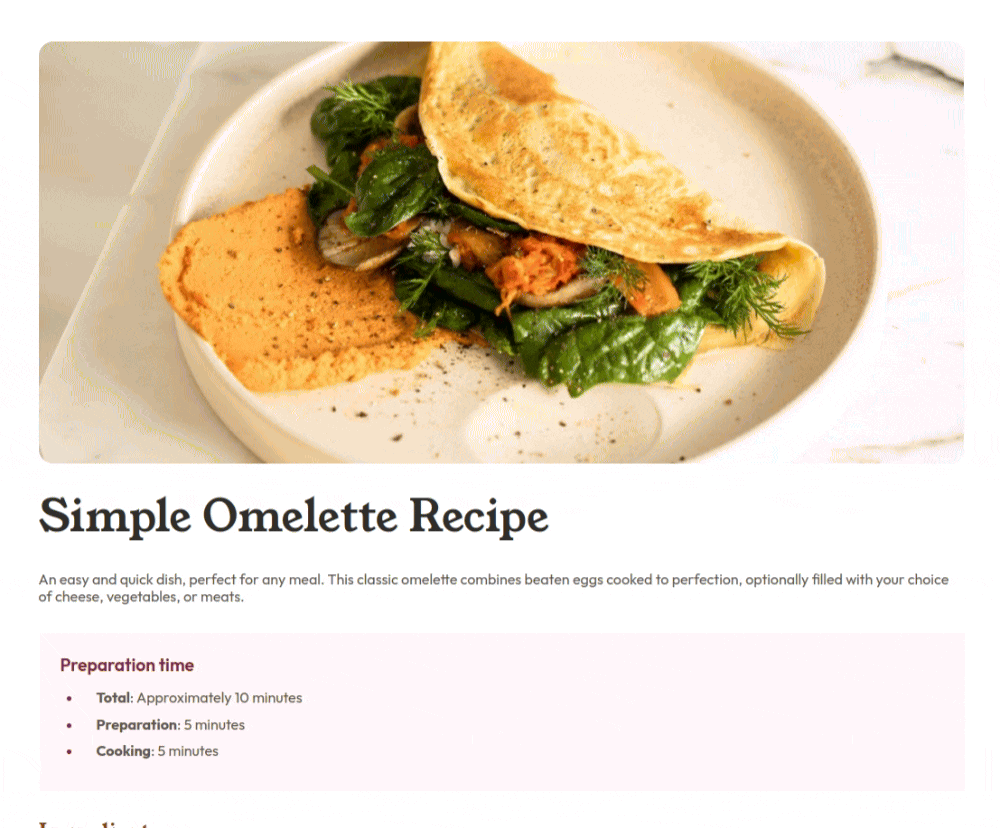
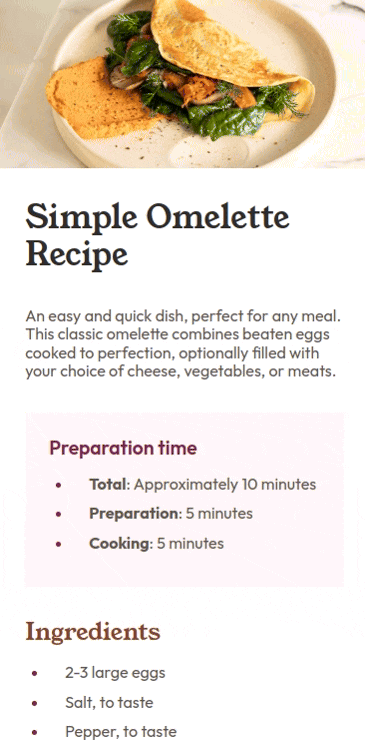

# Frontend Mentor Project
> This repository was created for my [Frontend Mentor](https://www.frontendmentor.io/challenges) challenges.

---

## Summary

- [Recipe page](#recipe-page)

## Challenges

### Recipe page

Challenge level = **Newbie** 
This is a solution for the [Recipe Page](https://www.frontendmentor.io/challenges/recipe-page-KiTsR8QQKm) challenge.

#### Screenshots

[my solution](https://anac-ac.github.io/frontend-mentor/level-newbie/recipe-page/index.html)

    
&nbsp; &nbsp; &nbsp; &nbsp;
       

#### Skills praticadas

- Semantics in HTML5
- Flexbox display
- Responsiveness

---
